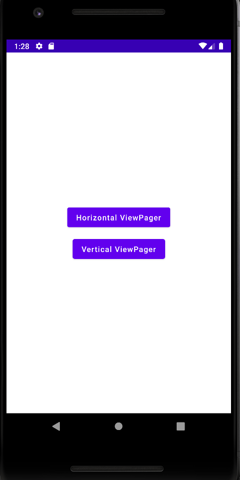
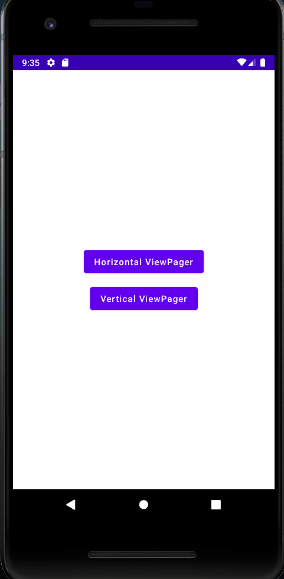

# Compose Pager

Two Activities with Horizontal, Vertical Pager Implementation. I use the same PageItem for both
Screens.

# What you learn?

In this repository you learn about implementation of ViewPager in Compose

🧬 Horizontal Pager
------------

🧬 Vertical Pager
------------

For more information about Compose Pager visit the original documentation
link [Pager] (https://google.github.io/accompanist/pager/) 

